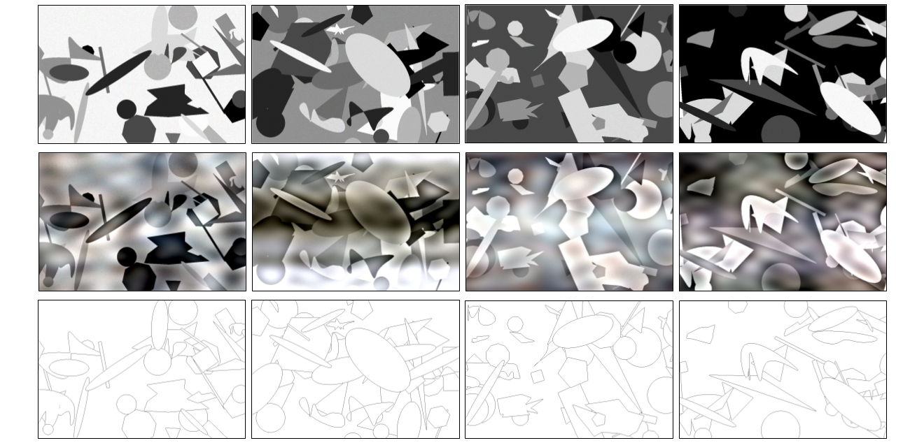

# SynShapes: A synthetic Image-Annotation dataset for Edge Detection (Paper)

## Overview

<div style="text-align:center">
</div>

[SynShapes](https://www.kaggle.com/datasets/guilloth3b3st/synshapes) Dataset is composed of synthetic images paired with exact edge map annotation; and composed of geometric shapes, with randomness applied to selected parameters, including color, quantity, size, and spatial position. Fixed parameters include the image resolution (1280×720), the total number of images (125), the edge thickness (1 pixel), and the noise type (speckle). The set of geometric primitives comprises: ellipses, circles, rectangles, triangles, regular polygons, and irregular polygons.

Visit [GitHub Page](https://vision-cidis.github.io/SynShapes/)

## Citation
If you use the SynShapes dataset, please cite the following paper (accepted paper)

```
@article{Castillo_VISAPP_2026,
    title={SynShapes: A synthetic Image-Annotation dataset for Edge Detection},
    author={Castillo, Guillermo A.  and Soria, Xavier  and Sappa, Angel D.},
    journal={21th Int. Conf. on Computer Vision Theory and Applications, VISAPP},
    volume={},
    year={2026},
    url={https://your-domain.com/your-project-page}
    pages={}
}
```

## Acknowledgments
For more info and to start using the template, please go to the original repository: [Here](https://github.com/eliahuhorwitz/Academic-project-page-template)

## Website License
<a rel="license" href="http://creativecommons.org/licenses/by-sa/4.0/"></a><br />This work is licensed under a <a rel="license" href="http://creativecommons.org/licenses/by-sa/4.0/">Creative Commons Attribution-ShareAlike 4.0 International License</a>.
